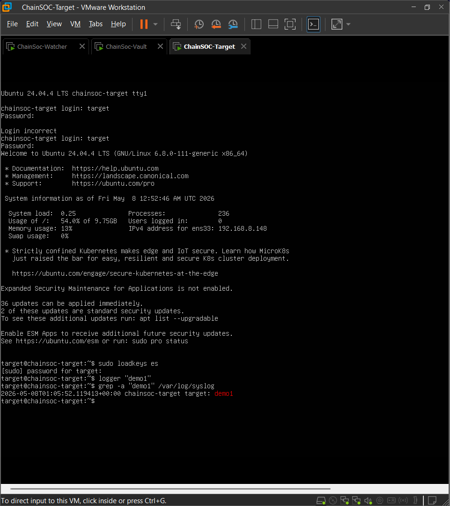
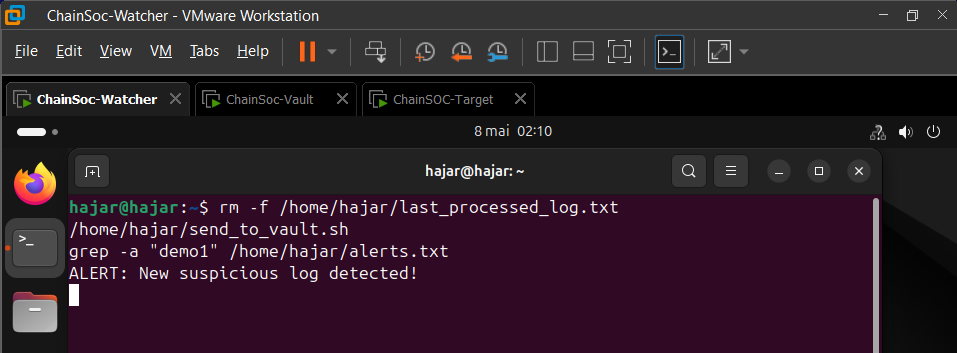
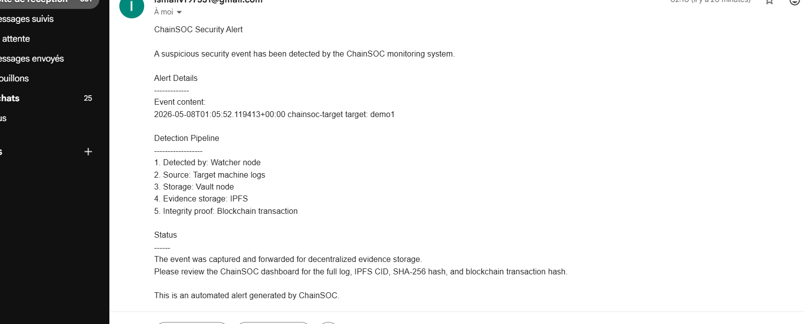
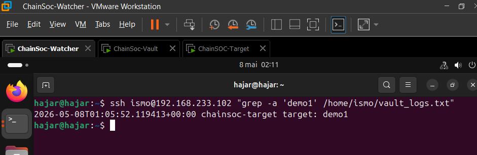
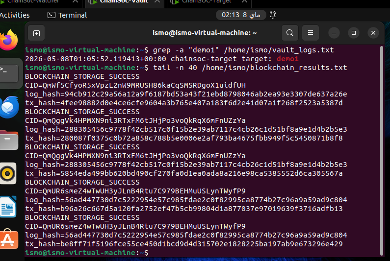
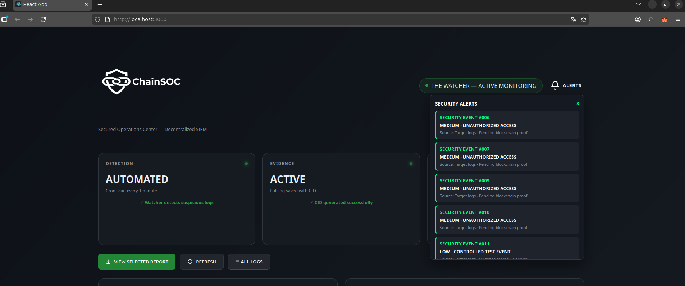
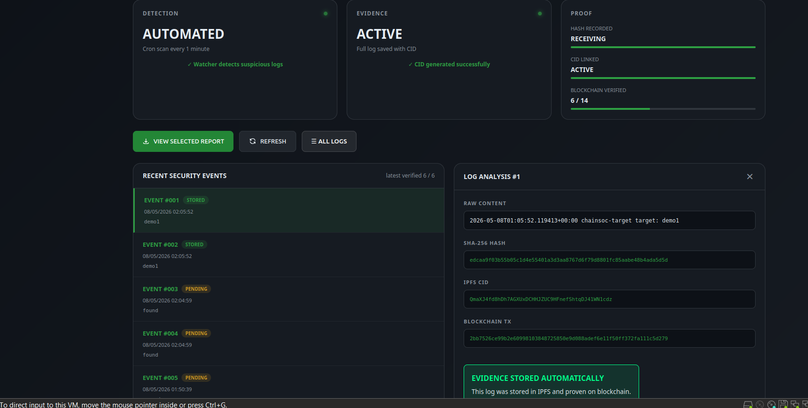
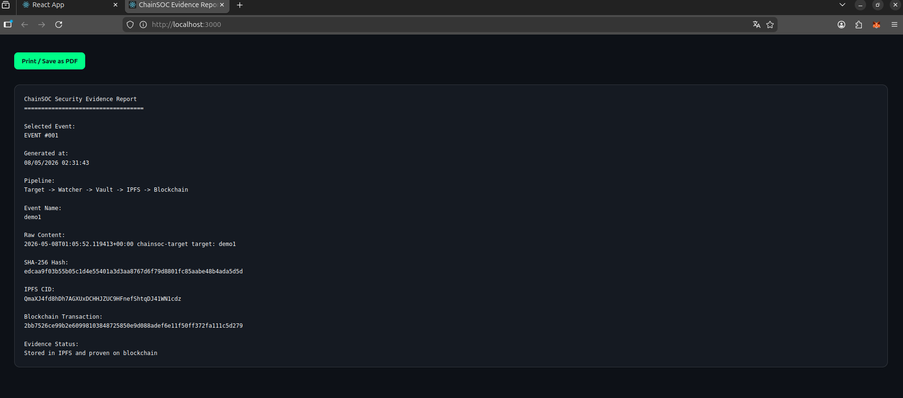

# ChainSOC : Mini SOC/SIEM Décentralisé

ChainSOC est un système décentralisé de surveillance de sécurité (SOC/SIEM) conçu pour assurer une traçabilité totale et incorruptible des événements suspects. Le projet s'appuie sur une architecture distribuée intégrant des nœuds dédiés, le réseau IPFS pour le stockage décentralisé, et la technologie Blockchain pour ancrer les preuves d'intégrité de manière irréfutable.

## Architecture et Flux de Données

Le flux normal de détection et de traitement s'exécute de bout en bout de manière **100% automatique et fluide**.

```text
[ Target Machine ] 
       ↓ (Logs suspects)
[ Watcher Node ] → (Alerte Email)
       ↓ (Transfert sécurisé)
[ Vault Node ] 
       ↓ (Hash SHA-256)
    [ IPFS ] → CID
       ↓ (Ancrage)
 [ Blockchain ] → Transaction Hash
       ↓ (Remontée)
[ Dashboard React ] → Export PDF
```

## Étapes de la Démonstration

### 1. Génération d'un Log Suspect
Un événement anormal est généré sur la machine cible afin de simuler une activité suspecte ou malveillante.

*Création d'un événement suspect sur la machine cible (Target).*

### 2. Détection Automatique par le Watcher
Le nœud Watcher surveille activement l'activité, détecte automatiquement l'anomalie et déclenche instantanément le processus de réponse.

*Détection automatique du log suspect par le nœud Watcher.*

### 3. Notification en Temps Réel
Simultanément à la détection, une notification détaillée de sécurité est expédiée par email à l'administrateur système pour information.

*Réception automatique de l'alerte de sécurité par email suite à la détection.*

### 4. Transmission et Centralisation (Vault)
L'événement est transféré de manière sécurisée depuis la cible vers le nœud Vault (le coffre-fort numérique de ChainSOC) pour un traitement isolé.

*Transmission et réception sécurisée du log sur la machine Vault.*

### 5. Scellement Cryptographique (IPFS & Blockchain)
Le Watcher détecte automatiquement le log suspect et l'envoie au Vault ; le système garantit ensuite l'immuabilité et l'intégrité totale des preuves générées en associant l'empreinte SHA-256 de l'événement à un CID IPFS, le tout certifié et ancré par une transaction inaltérable sur la blockchain.

*Génération automatique du CID IPFS et de la transaction blockchain pour sceller le log.*

### 6. Supervision depuis le Dashboard
L'interface web centralisée récupère et affiche l'ensemble des alertes en temps réel, offrant à l'équipe de sécurité une vue d'ensemble sur le système.

*Vue générale du Dashboard ChainSOC affichant le panneau d'alertes en temps réel.*

### 7. Détails des Preuves Cryptographiques
Le Dashboard permet d'inspecter les métadonnées de sécurité de chaque événement stocké, assurant la chaîne de traçabilité de bout en bout.

*Visualisation des preuves cryptographiques (Hash, CID IPFS, Transaction) depuis le Dashboard.*

### 8. Génération du Rapport d'Évidence
Pour des besoins d'audit ou de conformité, un rapport d'évidence complet peut être généré automatiquement et exporté sous format document (PDF).

*Rapport d'évidence de sécurité généré automatiquement pour export.*

---

## Intégrité et Sécurité
La chaîne de traçabilité est assurée de bout en bout. La compromission ou la modification d'un log après coup est rendue mathématiquement impossible : toute altération d'un fichier modifierait son empreinte cryptographique (hash SHA-256), ce qui invaliderait instantanément le CID IPFS et déconnecterait la preuve de sa transaction originelle sur la blockchain.
